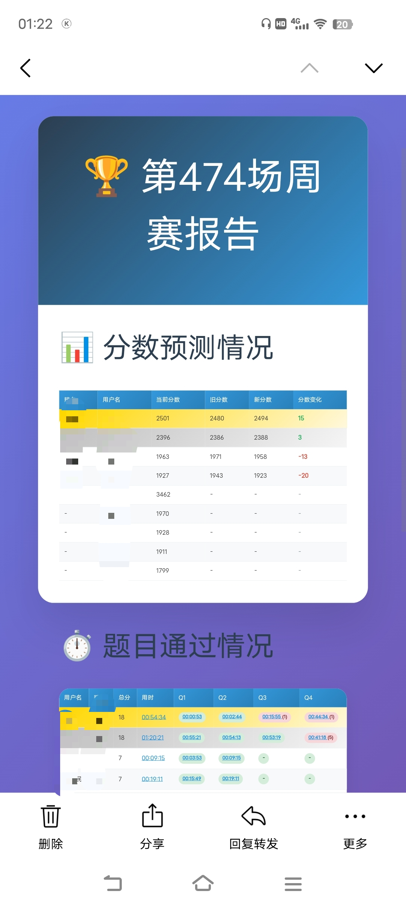

## 力扣周赛分数预测推送

### 自定义

[修改关注用户](./wx-send-email.js)

```js
// 查询的用户集合
const queryUserNames = new Set([
  "agitated-curranfnd",
]);

// 备注
const userRealNameMap = {
"agitated-curranfnd": "nlogn",
};

```


在本地使用
```
node ./wx-send-email.js -1
```


设置私钥

`https://github.com/username/repo/settings/secrets/actions`

找到 `Secerts and variables`

添加 

- `QQ_EMAIL` 邮箱

- `QQ_EMAIL_AUTH_CODE` 邮箱有效访问授权码

如何开通邮箱访问授权码请看[这里](https://help.mail.qq.com/detail/106/985)

### 效果预览

